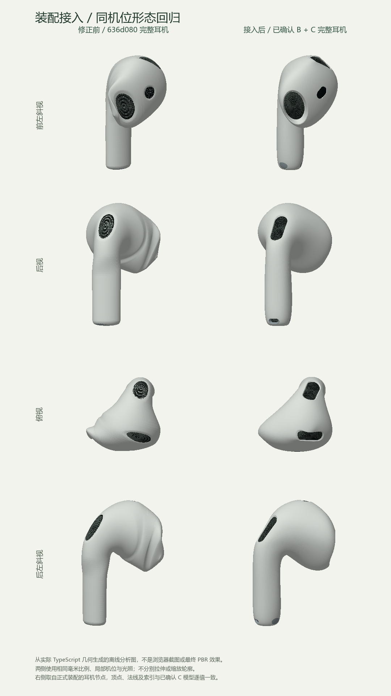

# D 检查点：新耳机装配与回归

- 日期：2026-09-25。用户已分别确认 B 裸壳和 C 局部细节。
- **D 实现、自动测试与本地浏览器自检完成；2026-09-25 用户反馈“效果可以的，验收”，视觉验收通过。**
- 主页面与生产构建均已使用新耳机；没有进入第四阶段动画，也没有修改充电盒外轮廓。

## 打开与验收

本轮实际开发地址：[整套产品](http://127.0.0.1:57907/)，仅监听 `127.0.0.1`。未来重启以实际端口为准。

1. 默认“开盖双耳”：检查两只耳机与盒口的关系，再切换“闭合主视觉”和开发面板“分开展示”。
2. 选择开发面板“单耳后视 / 顶视 / 后左斜视”，确认已认可的线条在整套产品中未回退。这里是局部正交方向，与下方整套产品略带俯角的“背面”按钮不同。
3. 勾选“统一灰模”或“条带高光”，检查背肩与头颈转折；点击“重置”恢复白塑料 / 金属和开盖双耳。线框优先于条带，条带优先于灰模。
4. 用 0–115° 静态滑块检查盒盖避让，再选择“内胆”检查凹腔；这些是立即切换的检查姿态，不是正式开合动画。
5. B / C 局部评审继续保留，可从主页链接回看。C 细节开关只影响该独立评审，不修改整套产品。

## 实际修改

### 已确认形态直接接入

- `createEarbud.ts` 不再按整只耳机包围盒分别拉伸 X / Y / Z。正式左右耳的位置、法线、索引、材质分组，与 C 生成器逐值一致。
- C 模型先生成固定 CPU 模板，每个正式实例克隆独立几何，再为左耳烘焙镜像并修正面绕序。模板从不加入场景或上传 GPU；原评审控制器及其隐藏裸壳随模板创建结束释放。
- `LeftEarbud` / `RightEarbud`、外壳节点命名及共享物理材质约定保留。孔缘、网罩封底、传感器与触点属于同一闭合壳的材质分组，几何细网仍单独绘制。
- 产品释放去重且幂等；测试确认多个产品不共享可变几何或生命周期。未增加依赖。

### 收纳空间重新生成，外形不变

- 包络输入换成冻结 B 曲面的 `64 × 96` 采样网格；不再创建旧耳机、读取附件包围盒或执行逐轴归一化。
- 保留原有 **0.45 mm 展示间隙**、0.4 mm 截面薄带、铰链与收纳姿态参数。盒盖包络仍使用 0–60°、每 3° 的初段扫掠，回归覆盖 0–115°。
- 首轮接入发现左侧头颈附近 **1 个顶点** 被原槽壁三角形切入。将盒体槽壁纵向区间从 54 加密为 108 后消除；未扩大间隙或 `insideCavity` 判断容差。槽口、内壁随新包络更新，充电盒外壳、盒盖外壳、铰链位置不变。
- 检查槽壁顶点到同高度胶囊外轮廓的最小水平余量：盒体约 **0.845 mm**，盒盖约 **0.572 mm**。这是展示模型的水平采样余量，**不等于真实壁厚或制造公差**。见 [测量记录](earbud-assembly-review/cavity-metrics.json)。

### 冻结证据

[SHA-256 前后记录](earbud-assembly-review/frozen-sources.json) 中以下 8 个文件一致：

- B：`earbudDefinition.ts`、`createEarbudShell.ts`。
- C：`earbudFeatures.ts`、`createDetailedEarbud.ts`。
- 外形 / 配置：`createCase.ts`、`caseSurface.ts`、`profiles.ts`、`config/product.ts`。

`createCase.ts` 仍调用同一腔体接口，因此其源码未变不表示内腔几何未变；本轮明确重建的是内腔，而非外壳。

## 同机位形态回归

两侧均由实际 TypeScript 几何生成，右侧取自正式装配节点；同毫米比例、同局部机位，不分别缩放。图为**离线分析图，不是浏览器截图或最终 PBR 效果**。浏览器中的实际渲染另以内联截图检查，没有保存浏览器截图文件。

## 自动检查

- **13 个测试文件、71 项通过**：[日志](earbud-assembly-review/tests.txt)。保留 B / C 的几何质量检查和原三向剪影门槛。
- 新增正式接入逐值一致、独立几何 / 幂等释放、完整耳机收纳、槽壁未穿出外壳、面重心开盖采样、包络缓存隔离、无效角度和局部检查方向测试。
- 旧壳顶点避让测试仍以 0–115° **每 1°** 检查正式新壳；另覆盖完整耳机（含细网）全部顶点的闭合收纳，并以全部耳机三角面的重心在 **每 5°** 检查开盖避让。均未检出穿入。
- 上述是离散顶点 / 面重心 / 角度采样，不声称是所有连续角度的精确三角形碰撞证明，也不声称验证了真实机械结构。
- 迁移旧断言：尺寸从“被强制拉伸后的规格框”改为 C 已确认实际尺寸约 `18.238 × 30.198 × 18.386 mm` 的严格数值回归；另用逐值接入测试防二次形变。独立传感器节点 / 单材质断言改为闭合壳材质分组检查，没有放宽轮廓或碰撞阈值。
- `vitest.config.ts` 限制最多 2 个测试 worker，避免默认按核心数同时创建大量密集网格；法线仍逐个检查，只汇总最大误差而不创建几十万个 matcher。长扫掠测试单独声明 30 秒超时，不影响几何容差。
- 提交前复核：全量运行时实例隔离测试耗时 5191 ms，超过默认 5000 ms；单独复跑该文件 7 项全部通过。该测试包含首次包络生成与多个密集模型创建，现为该项单独设置 30 秒时限，不修改模型、断言或几何容差。调整后按默认全量命令重跑，13 个文件 / 71 项通过（28.47 秒），类型检查、生产构建及 Prettier 亦通过。
- [类型检查](earbud-assembly-review/typecheck.txt)、[生产构建](earbud-assembly-review/build.txt)通过；Prettier、`git diff --check` 通过。
- 正式 JS 为 **624.53 kB / gzip 162.39 kB**，仍保留原有 > 500 kB 警告；未关闭警告，也未声称完成后续性能优化阶段。

## 本地浏览器验证

- 使用 Chrome DevTools 独立隔离页面，实际查看桌面 1440 × 1200：默认开盖、闭合、分开展示、空盒内胆，单耳六向与四个斜视；灰模与条带检查未见原背肩褶皱回退。
- 只读诊断核对“单耳后视”方向为 `[0, 0, -1]`（浮点舍入误差量级），顶 / 仰视用独立上轴；所有局部检查先重置耳机姿态，不使用分开展示的倾转角。
- 实测拖动旋转、按钮缩放 / 重置、滑块键盘 Home 与方向键。五轮姿态、材质与局部视角切换后，GPU 计数保持 **27 geometries / 6 textures**。这只是短时稳定性检查，不能替代长期泄漏分析。
- 实际查看 390 × 844 与 320 × 760 窄屏，文档宽度等于视口，模型完整显示、按钮换行；未进行真机或全浏览器矩阵测试。
- 模拟 WebGL 上下文丢失：提示、重试按钮和禁用控件正常；渲染停止，不会因页面可见性变化重启失效循环。点击重新加载恢复。正常页面无控制台 error / warn。
- 生产预览实际渲染新整套产品；附带 `?review=earbud-details` 仍不启用开发评审，无诊断全局或检查面板。网络仅本机 HTML / JS / CSS 三个请求，没有外部产品模型、图片或 HDR。

## 边界与下一步

- **D 已通过用户视觉验收，A / B / C / D 几何修正收尾；此结论依据用户明确反馈，不以自动检查替代。**
- 内胆、铰链、收纳间隙和 115° 上限仍是展示参数；没有重新取得制造图或内部结构实测数据。
- C 已列明的微小刻字、L/R 印字、模具分缝、触控面微小压平等近似边界保持。
- 本轮没有更改原物理材质参数或灯光；没有开合 / 取出动画、热点、导出或后续阶段功能。
- 开发服务保留供回看；临时生产预览在验证后清理。用户已授权将本轮修正提交为本地验收基线，不推送远程；第四阶段仍未开始。
