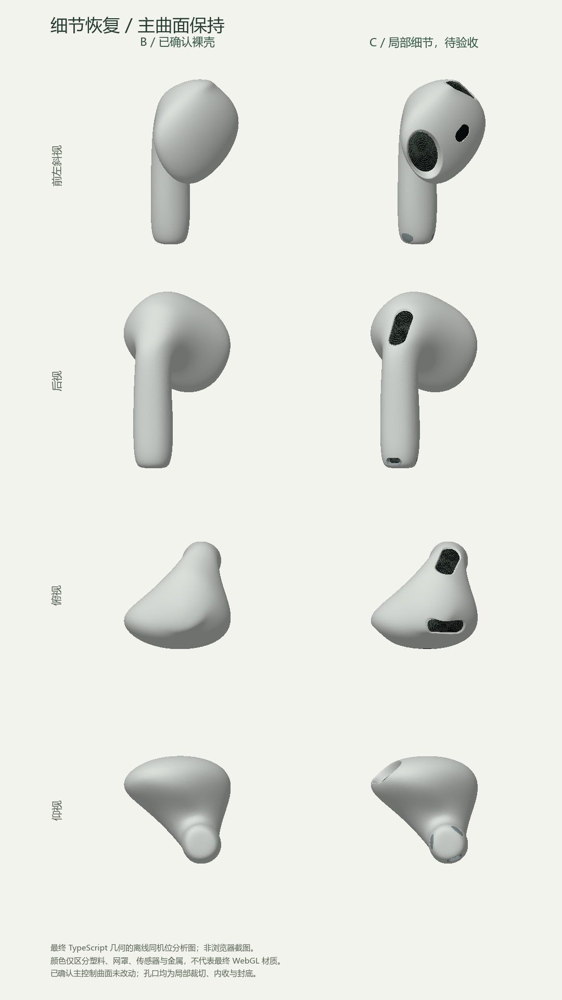

# C 检查点：细节与左右耳

- 日期：2026-09-25。用户已回复“确认”，B 裸壳形态验收通过。
- **2026-09-25 用户再次回复“确认”，C 细节与左右耳验收通过。未提交 Git。**
- 下文保留 C 交付时的范围、64 项测试与截图检查结果；当前装配进度见 [D 记录](earbud-assembly-review.md)，不进入动画阶段。

## 打开与验收

开发服务实际地址后加 `?review=earbud-details`，或点击主页“进入 C 细节与左右耳评审”。本轮已核实地址：`http://127.0.0.1:57907/?review=earbud-details`，仅监听 `127.0.0.1`；未来重启以真实端口为准。

1. 默认左侧为已确认裸壳，右侧恢复细节；两侧同机位、同尺度、同光照。
2. 在前左斜视检查出音口与传感器，后视检查背侧麦克风，俯视检查顶部通气口，仰视与后侧斜视检查柄底麦克风和触点。
3. 用七个复选框逐项开关，或“全部关闭 / 全部恢复”。关闭后不是仅隐藏网罩，而是连孔口一起恢复原裸壳。
4. 切换“左右耳”检查镜像位置；它是同机位局部比较，不代表收纳姿态。
5. 切换白塑料 / 金属、灰模、条带和轮廓。孔口附近的局部高光应变化，背肩和主轮廓不应重新出现原有褶皱。

确认 C 后再实施 D；仍可通过 `?review=earbud-shell` 回看已确认主曲面与旧版本的对比。

## 冻结与改动范围

`earbudDefinition.ts`、`createEarbudShell.ts` 的 SHA-256 在本轮前后完全一致，见 [冻结记录](earbud-details-review/frozen-shell-sha256.json)。没有为了开孔修改主控制点，没有恢复包围盒逐轴拉伸。

新增：

- `earbudFeatures.ts`：区域、曲面锚点、局部正交切线基底、毫米特征尺寸和材质角色。通过局部投影反求原曲面，不用平面贴片悬浮在塑料壳上。
- `createDetailedEarbud.ts`：在原三角面边上裁切特征轮廓，孔缘外环共享边界索引；孔缘内收与封底连续连接，再加入贴合凹腔的几何细网。
- 左耳镜像烘焙到顶点、法线和三角面绕序，不用负节点缩放。七项开关每次从原裸壳重建，不累积变形；替换时释放旧几何。
- 评审复用原物理材质和一次生成的程序化环境，不修改原产品灯光 / 材质参数。增加四种对照模式与逐项开关，未改充电盒或旧装配创建逻辑。

### 展示参数，而非制造尺寸

| 特征 | 外口长 × 短轴（mm） | 内收深度（mm） | 处理 |
| --- | --- | --- | --- |
| 出音口 | 9.4 × 6.0 | 1.8 | 椭圆孔缘与凹入几何网罩 |
| 佩戴传感器 | 3.65 × 2.4 | 0.07 | 胶囊轮廓、深色物理材质 |
| 背侧麦克风 | 8.4 × 3.6 | 0.3 | 胶囊孔口与细网 |
| 顶部通气口 | 7.8 × 2.8 | 0.25 | 沿冠面映射的孔口与细网 |
| 柄底麦克风 | 2.8 × 1.4 | 0.6 | 金属孔缘与内凹细网 |
| 两处侧面触点 | 各 2.8 × 1.85 | 0.025 | 椭圆局部嵌面、金属材质 |

内口按各自比例缩进，外口尺寸不等于深色网罩尺寸。参数来自官方图片与 AR 的相对位置 / 范围辅助校准，不是官方提供的制造尺寸。深出音口沿固定局部法向内收，避免不同表面法线的内偏移在强曲率处翻折。所有孔口是**带封底的展示凹腔**，不是贯通的真实声学通道。

## 同机位对照

这是最终 TypeScript 几何生成的离线分析图，**不是浏览器截图**。颜色仅用于区分材质区域；实际物理高光以网页为准。浏览器截图通过工具以内联方式实际查看，未声称已保存为本地图片。

## 几何与工程验证

### 数据

[最终几何记录](earbud-details-review/geometry-metrics.json)：

- 壳体含孔缘 / 封底：53,496 顶点，106,988 三角形；几何细网单独绘制。
- 完整耳机局部尺寸约 18.238 × 30.198 × 18.386 mm，继承 B 的近似范围，不强制逐轴缩放到官方包围尺寸。
- 壳体闭合、Euler = 2、正体积，无退化面；全部显示壳的非邻接面相交检查未检出相交。
- 最大相邻三角面夹角约 37.67°，位于刻意内收的孔缘区域；局部细节使用 < 45° 的防翻折回归门槛。不能将此门槛用于裸壳，也没有放宽 B 的 < 15° 门槛。
- 独立测试验证每项细节区域之外的原顶点与法线逐值保持；全部关闭后，位置、法线和索引与 B 裸壳完全相同。
- 检查镜像的顶点、法线、绕序与正体积。对四处几何网罩进行射线采样，确认采样点在封底外侧、间隙 < 0.08 mm；这是采样检查，不是任意精度碰撞证明。

### 本轮发现并修正的问题

1. 单纯按切平面投影裁切会误选另一侧壳面，增加法线朝向与局部距离过滤。
2. 冠面极点附近，将裁切交点重新投回样条会使原平面三角形产生微小翻面，改为在线性三角边上裁切并共享交点。
3. 深出音口沿每点不同法线缩进会产生局部折角，改为固定局部法向；孔缘加密，并平滑消除原三角面与连续曲面之间的微小弦差。
4. 窄屏斜视边缘余量不足，统一增大最小正交半宽；新增左右镜像所有固定视图至少保留 1 mm 水平余量的测试，不独立缩放两只耳机。

### 工程命令

- `npm run typecheck`：通过，[日志](earbud-details-review/typecheck.txt)。
- `npm run test -- --run`：12 个文件、64 项通过，[日志](earbud-details-review/tests.txt)。包含此前 55 项检查、8 项细节测试及新增窄屏余量测试。
- `npm run build`：通过，[日志](earbud-details-review/build.txt)。正式 JS 仍为 612.93 kB（gzip 157.27 kB）；保留原有 > 500 kB 警告。
- Prettier 和 `git diff --check`：通过。未增加依赖，未修改原有三向轮廓阈值。

## 浏览器自检

- Chrome DevTools 独立隔离页面；实际查看桌面 1440 × 1200 的六向和四个斜视，以及灰模、条带、物理材质与左右耳。细节关闭后的主曲面条带与裸壳一致；未见 B 之前的背肩褶皱重新出现。
- 实测逐项开关、全部关闭 / 恢复、四种对照和四种材质、缩放与重置。14 次逐项切换实测平均约 384 ms、最大约 714 ms（当前本机）；这是开发评审的同步几何重建，不在旋转渲染循环内执行，不作为移动设备性能保证。
- 完成全部模式预热后，六轮全部关闭 / 恢复再预热，GPU 统计保持 11 geometries / 2 textures；短时无持续增长。单元测试另外覆盖替换释放、幂等释放和不释放借用材质；不把短时计数当成完整泄漏证明。
- 实际查看 390 × 844 和 320 × 760 窄屏，文档宽度与视口一致；左右耳均完整显示，控件换行且可操作。
- 模拟 WebGL 上下文丢失后，错误提示与重试按钮可见，按钮和复选框禁用；重载恢复。正常页面无控制台 error / warn。
- 生产预览实际渲染原整套模型；附带 C query 也不启用评审，无诊断全局、细节开关或开发面板。构建产物中未检出新壳 / 细节代码标记，网络仅请求本机 HTML、JS、CSS，没有官方模型或图片请求。

## C 交付当时的边界

- C 交付时等待用户视觉确认，现已确认；D 保持其参数与主曲面不变，不能为装配迁就而修改已验收形态。
- 本轮未添加微小刻字、L/R 印字、模具分缝、耳柄触控面的微小压平，未实现电子内部结构。
- C 的“左右耳”只是局部镜像检查；没有验证新耳机在盒中收纳或开盖避让。主页和生产模型仍是原装配，下一步 D 才替换、更新包络并完整回归。
- 未自动提交 Git，也未进入第四阶段动画。
