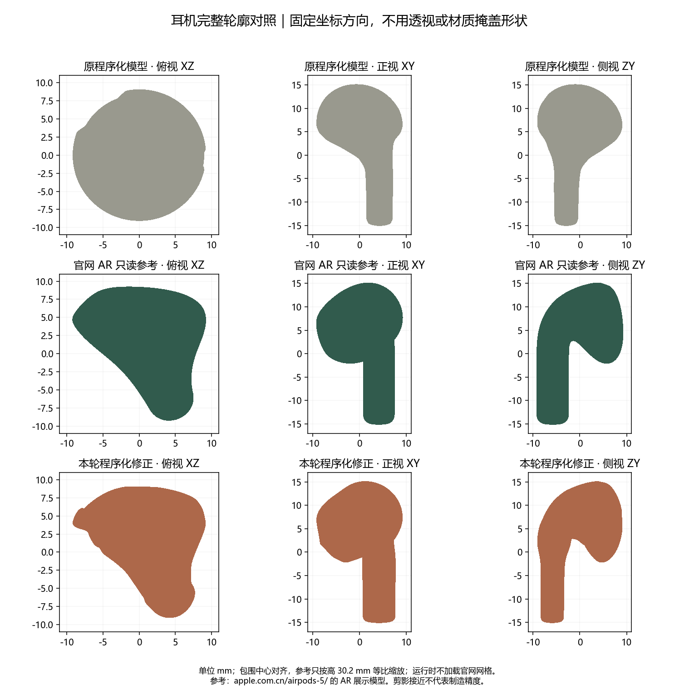
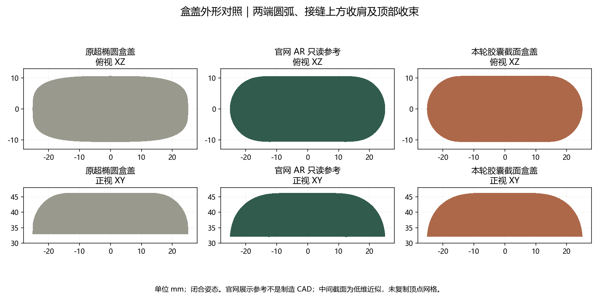

# 耳机与盒盖形态专项校准

日期：2026-09-24。基线：`4e0d7aa`。开发完成后未自动提交；2026-09-25 按用户要求进行本地 Git 提交，不推送远程。提交不代表最终视觉验收通过，不进入第四阶段动画。

## 依据与问题定位

- 用户指定的 [Apple 中国官网](https://www.apple.com.cn/airpods-5/)：双耳、耳部特写、闭合盒图；并沿用已查看的标准版空盒参考。
- 同页 [AR 展示文件](https://www.apple.com.cn/105/media/us/airpods-5/2026/1bae77a6-82ef-46c2-875f-571e880dbfe2/ar/airpods-mid.usdz) 只用于离线核对，不加入网页，不复制其顶点网格。程序仍使用独立的少量控制参数生成全部产品几何。
- 原耳机头部水平截面半径接近相等，尺寸正确但俯视近圆；原盒盖超椭圆截面偏方、收肩偏晚、顶端留有过大的平片。
- 不将耳机完整俯视轮廓误当成单独耳塞截面：完整投影包含外露耳柄、颈部与出音端。

## 实施

1. `earbudSurface.ts` 使用弯曲主轴、逐段倾角 / 偏航、非对称截面和保形插值。耳柄至头部保持一个封闭网格，左右镜像；局部尺寸仍归一到 18.3 × 30.2 × 18.1 mm。
2. 出音口、传感器、外侧麦克风与顶部通气孔重新按曲面定位；孔缘纵向加密，避免小开口出现锯齿形切边。保留现有材质、网罩与触点。
3. `caseSurface.ts` 将充电盒与盒盖截面改为直边 / 圆弧相切的胶囊；盒盖从接缝上方开始收肩，顶部收束到窄脊。整体规格保持 50.1 × 46.2 × 21.2 mm。
4. `earbudCavity.ts` 从同源低密度曲面生成收纳槽和开盖初段的避让包络，留 0.45 mm 展示间隙，缓存轮廓。按多边形面积重心重采样，避免凸包顶点数量变化引起截面抖动；检验仍使用完整高密度耳机。
5. 接缝、耳机收纳高度与开盖姿态同步调整。简化铰链保留后置旋转轴，没有将 AR 展示姿态枢轴直接视为实物机械轴。115° 是检查姿态，不是制造限位。
6. 开发面板新增单耳正交三视图与闭合盒盖正交顶 / 正视。单耳取消展示倾斜，轮廓检查关闭地面阴影；普通观察恢复透视。

## 轮廓对照

三向耳机投影：右耳局部坐标，+Y 向上，俯视 XZ、正视 XY、侧视 ZY。以完整包围中心对齐，官网参考仅按高度 30.2 mm 等比缩放，不单独拉伸宽 / 深、不优化旋转。程序模型保持既定规格。

离线 801 × 801 二值投影的交并比（IoU）：

| 方向 | 原模型 | 修正后 |
| ---- | -----: | -----: |
| 俯视 | 0.6369 | 0.9491 |
| 正视 | 0.8272 | 0.9700 |
| 侧视 | 0.5839 | 0.8936 |

这衡量的是**轮廓投影**，不是整体还原率或制造精度。尤其侧面局部曲率、头部下缘及出音端仍有近似差异。图中盒盖参考合并白色外壳层，避免单层铰链开口被误当作完整外轮廓。

`earbudReference.ts` 仅保留独立参考投影的稀疏二维轮廓。Vitest 以 180 × 180 网格光栅化当前全部耳机三角形，回归阈值为俯视 0.92、正视 0.95、侧视 0.87；不要求低分辨率测试数字与上述离线数字完全相等。

## 验证

- 原模型的俯视 / 侧视探针和盒盖收肩 / 胶囊轮廓测试先失败，再由实现修正；没有只修改测试容差。
- 检查尺寸、有限坐标、单位法线、非退化面、闭合边、正体积、左右镜像与材质共享。
- 基础曲面以 999 个纵向位置 × 96 个周向位置检查法线无向内翻折。这不是完整的任意三角形自交证明。
- 收纳测试覆盖左右耳完整壳顶点；开盖以 0–115°、1° 步长采样。内腔判定包含实际三角化墙体的对角线交点，不用圆 / 椭圆或双线性轮廓替代。
- 外壁按左右槽、各采样层及层间位置检查，至少保留 0.2 mm 截面余量；这不是加工公差或连续碰撞检测。
- Chrome DevTools 实际查看：单耳灰模三视图、材质特写、开盖俯视、空盒内胆、盒盖闭合正交正 / 顶视；普通 / 正交切换、隐藏耳机、45° 滑块、重置正常。
- 实际 390 × 844 移动视口，无横向溢出；正交单耳与恢复后的开盖双耳均完成截图查看。恢复 1440 × 1000 桌面视口。
- 浏览器截图写文件被 MCP 工作区路径校验拒绝，未绕过。已查看工具返回的内联截图；上述两个文档图片是独立几何投影图，不是浏览器截图。

最终自动检查：9 个测试文件、41 项测试通过；类型检查、生产构建、Prettier 与 `git diff --check` 通过。结果另存 `geometry-tests.txt`、`geometry-typecheck.txt`、`geometry-build.txt`。构建保留 Three.js 分块超过 500 kB 的已有警告，没有关闭警告。收尾浏览器控制台无 error / warn，资源检查没有外部资产请求；已恢复开盖双耳与物理材质。

## 仍不宣称的能力

- 内胆是非圆保守收纳近似，不是官网内胆的精密复刻。
- 未获得工程 CAD；没有还原电子元件、精密铰链机构、序列号或真实制造公差。
- 未新增开合动画、热点或导出功能，没有新增运行时依赖或外部产品资产请求。
- 此轮交付是可复查的几何修正，最终视觉验收仍由用户确认。
