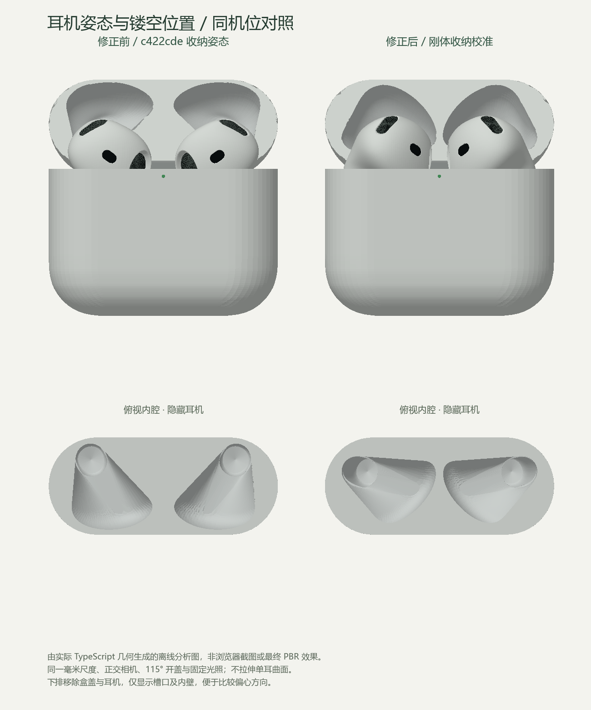

# 官网图驱动的耳机收纳与内腔校准

- 日期：2026-09-25；基线：用户已验收的 `c422cde`。
- **实现、自动检查和本地浏览器自检完成，等待用户视觉验收。** 本轮按用户要求本地提交，未进入第四阶段动画。
- 依据用户指定的[官网开盖图](https://www.apple.com.cn/v/airpods-5/b/images/overview/contrast/explore_airpods_5_in__gadkl3bf562y_xlarge_2x.jpg)，不是重新修改已确认的耳机曲面。

## 如何验收

打开[本地开发预览](http://127.0.0.1:57907/)，刷新页面；未来重启以实际端口为准。

1. 点击右侧 **“收纳正交正视”**，对照官网图检查双耳向内朝向、传感器位置和头部露出。该机位去除近距离透视的缩短，普通“正面”按钮仍为透视。
2. 点击 **“收纳正交顶视”**，再勾选 **“隐藏耳机”**，检查新的槽口位置、耳柄深孔偏心方向与两孔间隔。
3. 点击“内胆”看盒盖凹腔，再检查“闭合 / 开盖 / 分开展示”。
4. 进入单耳顶视或后视后返回整套，确认局部形态不变且恢复正确收纳朝向；“重置”恢复开盖双耳。

## 根因与修复

旧代码把独立单耳研究坐标直接用于收纳，旋转为零，只平移 X / Y；内腔也按这个姿态生成。因此“耳机能放进槽里”的自洽测试能通过，但它们一起偏离了官网图。原有包围盒和碰撞测试不能单独证明装配姿态正确。

本轮采用统一刚体坐标：

| 参数 | 旧右耳 | 新右耳 |
| --- | --- | --- |
| 位置 X / Y / Z，mm | 11.7 / 27.8 / 0 | **10.5 / 28.4 / -2** |
| 旋转，度 | 0 / 0 / 0 | **先 X 0°，再 Y -45°，再 Z -9°** |
| 节点缩放 | 1 / 1 / 1 | 1 / 1 / 1 |

- `earbudPlacement.ts` 为唯一收纳变换来源。左右耳关于 X=0 镜像，左耳节点使用镜像共轭旋转，不使用负缩放。
- `createProduct.ts` 正式开盖与闭合姿态调用该变换；分开展示保持原有位置和角度。
- `earbudCavity.ts` 用同一矩阵变换裸壳采样，再重建槽口、槽壁及盒盖扫掠。上下界取旋转后网格包围范围，不再错误使用 `seatY ± 原高度 / 2`。
- 保留原 **0.45 mm** 展示间隙、0.4 mm 截面薄带、108 层盒体槽壁和原盒盖扫掠方式；未放宽碰撞容差。
- 单耳检查清除收纳旋转。独立状态标志保证拖动后返回整套也能恢复；切换分开展示或闭合时不会被旧检查状态覆盖。

## 同机位对照

这是实际 TypeScript 几何生成的**离线分析图，不是浏览器截图或最终 PBR 效果**。旧几何取 D 基线的本地归档，新几何取当前正式产品；同毫米尺度、正交投影和 115° 开盖。下排仅显示盒体及内腔，隐藏盒盖和耳机。

## 形态冻结与几何边界

- B / C 四个几何源文件、`profiles.ts`、`caseSurface.ts` 前后 SHA-256 一致：[冻结记录](earbud-seating-review/frozen-sources.json)。
- `createCase.ts`、`createEarbud.ts`、材质及灯光代码相对基线无差异；盒壳、盒盖外轮廓、铰链和整体规格不变。`createCase.ts` 调用的内腔数据发生了预期变化。
- 当前腔壁到同高度外轮廓的最小水平采样余量：盒体 **2.266 mm**，盒盖 **1.266 mm**；左右腔体的最小水平中桥分别约 **1.505 mm / 1.362 mm**。见[几何指标](earbud-seating-review/geometry-metrics.json)。这些不是实际壁厚或制造公差。
- 单耳未旋转的局部尺寸不变；旋转后的包围尺寸会改变，不以逐轴缩放补偿。

## 自动检查

- **14 个测试文件、75 项通过**：[测试日志](earbud-seating-review/tests.txt)。保留原 B / C 局部形态、正式接入逐值一致、完整收纳、每 1° 壳顶点及每 5° 全部耳机面重心的开盖采样。
- 新增 4 项：图片关键点比例与头部露出、传感器/出音口朝向、镜像刚体与反复归位、腔体镜像与中桥。
- 新朝向测试已先在旧实现上失败：传感器不位于靠中线一侧；修复后通过，不仅测试“孔跟着耳机一起移动”。
- 图像关键点为 468 × 684 图上的人工近似坐标，仅统一按盒宽归一化，允许 2.5% 盒宽的参考/投影差异；不单独缩放各轴，不作为还原率或制造精度。
- 类型检查、生产构建、Prettier 与 `git diff --check` 通过。[构建日志](earbud-seating-review/build.txt) 中 JS **625.09 kB / gzip 162.63 kB**，原 >500 kB 警告保留。

## 实际浏览器自检

- Chrome DevTools 本任务隔离页面：查看桌面 1440 × 1100 的正交正视、正交顶视、隐藏耳机后的槽口、空内胆、闭合和分开展示，以及实际生产构建的开盖正面。
- 确认单耳检查为零旋转；返回收纳恢复新刚体姿态。单耳检查中实际拖动后返回普通正面也恢复正确；从检查状态进入分开或闭合时，界面姿态和模型姿态一致。
- 十轮单耳、分开、闭合、收纳视图及隐藏切换后，GPU 资源保持 **27 geometries / 6 textures**。这是短时回归，不替代长期性能测试。
- 390 × 844 移动视口下实际查看默认与收纳正视，`scrollWidth = innerWidth = 390`；新增按钮可换行。是浏览器模拟，不是真机验证。
- 正常页面无 console error / warn；生产构建无开发检查面板或诊断全局。资源仅本地 JS / CSS 与 HTML，未加载参考 JPG、官方模型或测试关键点文件。
- 浏览器截图以内联形式实际查看，没有保存截图文件；未改变浏览器/文件服务安全策略。临时生产预览验证后关闭，开发预览保留供验收。

## 限制与停止点

- 单张产品图不能确定唯一三维姿态、槽深和真实内部结构；位置与角度仍为展示级校准，不声称官方 CAD 或实测参数。
- 凹腔是贴合新姿态的保守包络，不是对真实注塑内胆、刻字或隐藏结构的精密复刻。
- 碰撞结果是离散网格与角度采样，不是连续运动的精确碰撞证明；没有借本轮实现开合或取出动画。
- 保留 D 的历史验收结论，本轮新增收纳校准另行等待用户确认；按用户要求本地提交，不推送远程，不以提交授权替代视觉验收。
