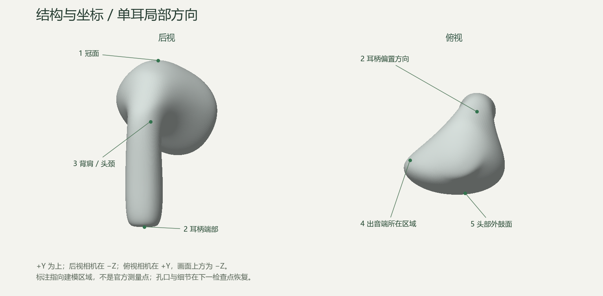
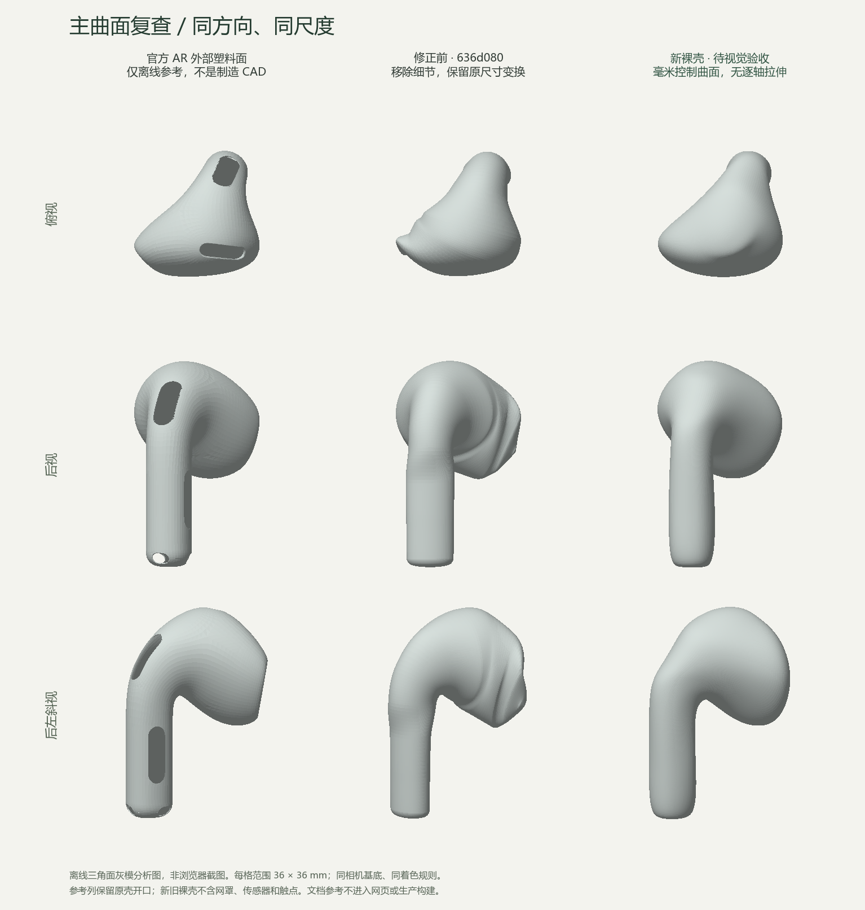

# 单耳裸壳重建：A / B 检查点

- 日期：2026-09-25；代码基线：`636d080e72585b6dd0553941e4770a42af88d296`。
- **2026-09-25 用户回复“确认”，B 裸壳形态验收通过。未提交 Git。** 主控制曲面和基础采样源码已冻结；后续 C 细节结果见 [新记录](earbud-details-review.md)。下文保留 B 交付当时的检查范围和数值。
- 本轮只做参考对齐与右耳无细节主壳；没有恢复孔口、网罩、触点或左右耳，没有修改充电盒、收纳槽与装配，也没有进入动画阶段。
- 旧整套页面保留，避免未验收裸壳提前影响装配。新旧模型在独立开发页比较，生产构建暂不替换模型。

## 打开与验收

运行 `npm run dev`，使用终端实际地址并添加 `?review=earbud-shell`；也可从主页 B / C 回看入口进入。本轮已核实开发地址为 `http://127.0.0.1:57907/?review=earbud-shell`，仅监听本机；端口可能在未来重启时变化。当前整套接入状态见 [D 记录](earbud-assembly-review.md)，下文保留 B 交付时范围。

1. 默认后视、灰模、旧左新右。先检查背肩是否仍出现褶皱状起伏。
2. 切换俯视，检查出音端附近的非设计性尖凸、边线波浪；不把真实偏心轮廓强行改成椭圆。
3. 查看后左 / 后右斜视，再看正视、左右侧、仰视、前侧斜视，确认没有以牺牲另一方向来换取局部相似。
4. 切换条带反射，观察肩部和头颈条带是否连贯。纯色轮廓只检查边线，不能判定曲面平顺。
5. 可只看新壳或旧壳；拖动旋转、缩放，聚焦画布后用方向键旋转。“重置后视”恢复默认比较。

确认裸壳后再实施 C（细节与左右耳）和 D（装配回归）。若需要修改，请指出视图、区域和偏差方向；不靠加网罩或调高光掩盖形体问题。

## 参照与坐标

外观主依据为 [中国官网产品页](https://www.apple.com.cn/airpods-5/) 的双耳和特写。相同页面的 [AR 参考](https://www.apple.com.cn/105/media/us/airpods-5/2026/1bae77a6-82ef-46c2-875f-571e880dbfe2/ar/airpods-mid.usdz) 只用于离线三维校准，不作为浏览器模型资产，也不视为制造 CAD。

- 比较右耳；通过出音端、耳柄及背侧麦克风方向核对，非直接凭 AR 世界轴推断。
- 累计父级变换，处理其中反射对面绕序的影响。原单位厘米，统一转换为毫米。
- 以同一只完整耳机的包围中心作一次固定平移：世界毫米中心约 `[10.8230239, 35.57820261, 4.59211574]`；不把新生成结果重新居中拉伸，也不为各视图分别拟合姿态。
- +Y 向上；正视相机在 +Z，后视在 −Z，右视在 +X；俯视在 +Y，画面上方指向 −Z。此处是单耳建模坐标，不是整套开盖展示的世界观察方向。
- 耳柄底部收束点约 `(4.1, −15.1, −5.8) mm`，冠面收束点约 `(1.6, 15.1, 4.0) mm`；出音端所在区域朝 −X / +Z。它们是建模参数，不是官方测量点。
- 选取外部白塑料壳 `HIDXaaSAHZrqLDD`、底部外塑料盖 `RuCDaJBFOmjaTOj`；不拟合内部壳层、网罩或传感器。开孔邻域另外排除，孔口在本轮填为连续裸壳近似。

## 修改方式

| 问题 | 本轮处理 |
| --- | --- |
| 独立椭圆截面的中心、半径、转向变化造成非设计性波动 | 使用 14 × 16 自由三维控制网格；头部、背肩、头颈、耳柄共用周期三次样条 |
| 标量平顺不能保证整个三维壳平顺 | 离线加入法线、对应区域、双向覆盖、控制网格平顺和步长约束；保留头部下缘结构约束，避免一味磨圆 |
| 三轴包围盒拉伸改变形体 | 新壳直接使用毫米控制点，仅统一换算为场景单位；不调用旧模型的逐轴归一化 |
| 接缝、端部易翻折 | 周向共享顶点、内部共享控制网格；端部切平面明确约束，每端一个极点，不重叠拼接球体 |
| 剪影测试不能发现背面缺陷 | 新增实际三角面夹角、闭合 / 退化 / 交叉检查，以及六向 + 四斜视、灰模 / 条带检查 |

样条内部单节点维持 C2 连续；端部是收束边界，单独做几何、法线与视觉检查。不将“用了 NURBS”宣称为工业级曲率或精确复刻保证。控制系数并非官方顶点采样列表，网页不读取原始参考网格。

### 同机位对照

上图为最终 TypeScript 生成几何的离线三角面着色分析，**不是浏览器截图**。三列同方向、同尺度、同着色规则；参考列保留原壳开口，所以孔口黑区不应与封闭裸壳直接比较。灰模轮廓和大曲面趋势可比，不能从这张图推断材质还原度。

## 自动检查

保留原 41 项测试不变。先让新的折痕检测运行在旧无细节壳上，最大相邻三角面夹角约 34.00°，超过新增 15° 门槛；实现新控制曲面后通过。该指标依赖采样密度，因此只用作固定显示细分下的回归门槛，不视为还原率。

最终显示网格：128 周向 × 192 纵向细分，24,450 顶点、48,896 三角形。[原始数值](earbud-shell-review/geometry-metrics.json)：

| 项目 | 结果 / 边界 |
| --- | --- |
| 包围尺寸（宽 × 高 × 深） | 18.238 × 30.200 × 18.399 mm；目标 18.3 × 30.2 × 18.1 mm |
| 最大相邻三角面夹角 | 11.57°，新增门槛 < 15° |
| 99.9 分位面夹角 | 10.19°，新增门槛 < 12° |
| 闭合与拓扑 | 每边两面，Euler = 2，正体积，无退化面，有限单位法线 |
| 接缝与内部节点 | 周期位置 / 法线与内部二阶连续性检查通过 |
| 非邻接面相交 | 对全部显示三角形做 AABB + 分离轴检查，未检出；检查器包含共面重叠测试 |
| 俯 / 正 / 侧三向轮廓 IoU | 0.9555 / 0.9740 / 0.9599，沿用旧阈值 0.92 / 0.95 / 0.87，未放宽 |

新裸壳尺寸使用 ±0.35 mm 展示近似门槛，**不是制造公差，也没有修改旧装配的精确尺寸测试**。当前厚度比目标约大 0.30 mm，后续如需收紧应改对应控制区，不能恢复逐轴拉伸。网格不相交检查不等于对连续曲面任意采样精度的数学证明；正反向剪影也不构成独立的背面形体证据。

工程命令：

- `npm run typecheck`：通过，[日志](earbud-shell-review/typecheck.txt)。
- `npm run test -- --run`：11 文件、55 项通过，[日志](earbud-shell-review/tests.txt)。
- `npm run build`：通过，[日志](earbud-shell-review/build.txt)；JS 612.93 kB，gzip 157.27 kB，仍存在原有 > 500 kB 警告，没有关闭警告。
- `npx --no-install prettier --check src index.html vite.config.ts package.json tsconfig.json` 与 `git diff --check`：通过。

## 浏览器自检

使用 Chrome DevTools 独立隔离页，实际检查页面快照和 WebGL 截图，不用“工具连接成功”代替页面渲染证据。

- 桌面 1440 × 1080：六向及四个斜视均实际截图查看。新壳相较旧壳的俯视尖凸、背肩褶皱明显减少；条带反射下未见旧版的密集局部反折。属于开发者自检，不等于用户已认可。
- 390 × 844、320 × 760：实际查看窄屏截图，文档宽度等于视口宽度，没有横向溢出；默认新旧模型未被裁切。
- 实测新 / 旧 / 并排、三种材质、缩放、重置、方向键和鼠标拖动；相机状态相应变化。连续 30 轮视图 / 材质 / 模式切换前后保持 2 geometries / 1 texture；这是短时资源检查，不是完整泄漏证明。
- 模拟 WebGL 初始化失败，错误提示及重试按钮可见，其他控件禁用；重载后恢复。正常评审与原主页面无控制台 error / warn。
- 原整套主页面实际渲染，检查构图切换及重置；新入口能正常往返。旧装配尚未换用新壳，故旧装配测试通过不能作为新壳收纳验证。
- 生产预览实际渲染；即使附带评审 query 仍是原产品页，无新壳入口、检查面板或诊断全局。构建产物没有新壳 / 评审标记，运行时没有官网图片、USDZ / GLB 请求。
- 本次浏览器截图仅以内联方式查看，未保存为文件；上方 PNG 是另行生成并实际查看的离线分析图。

## 尚未验收与下一步

1. B 裸壳已由用户确认；C 细节阶段不得改变已确认控制点来迁就孔口。不按单项分数替代视觉验收。
2. 冠面、头部下缘和孔口周围仍是展示级近似，尚无制造截面资料；当前缺少细节会影响整体产品观感。
3. 新壳的左右镜像、开孔、网罩、触点、物理材质和充电盒收纳 / 避让尚未接入验证。
4. 按 [已批准方案](../plans/2026-09-25-earbud-surface-rebuild-design.md) 已从 B 进入 C；D 装配仍待下一检查点，不自动提交或推进动画开发。
